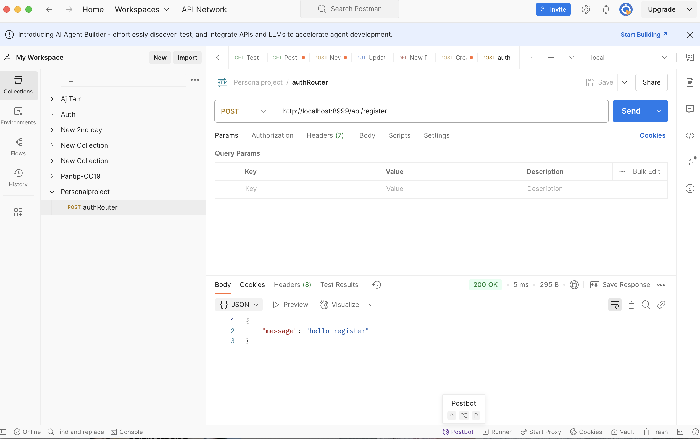
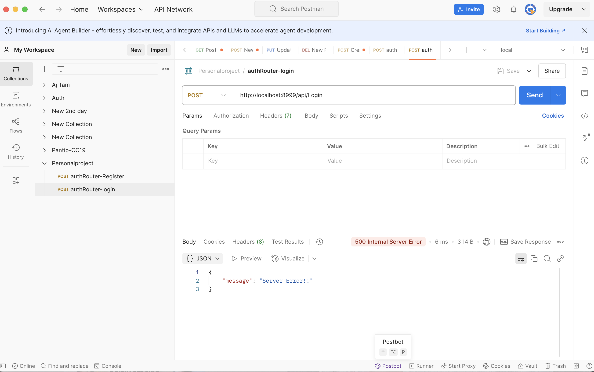
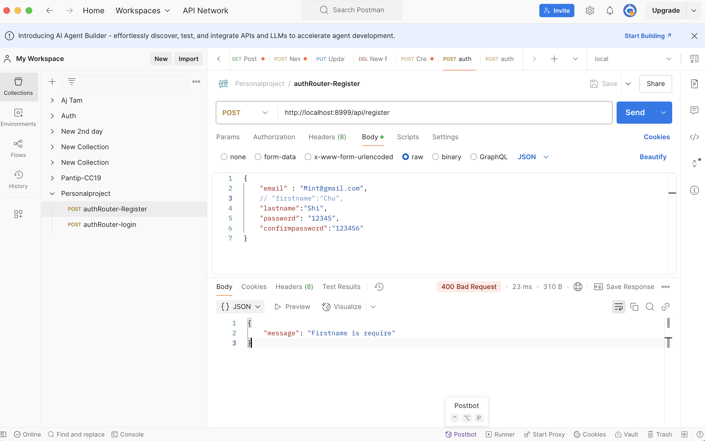

# Server 

## Step1 create package 

```bash
npm init -y

```

## Step 2 install package ...

```bash
npm install express nodemon cors morgan bcryptjs jsonwebtoken zod prisma

```
```bash
npx prisma init
```

## Step 3 Git 
```bash
git init
git add . 
git commit -m "message"
```
next step 
copy code from repo 

``` bash
git remote add origin https://github.com/ChutikarnMorakhao/personalproject-api.git
git branch -M main
git push -u origin main 
``` 

when update code
```bash
git add .
git commit -m "message"
git push
``` 

## Step 4 update package.json 

```js
"scripts": {
    "start": "nodemon index.js"
  },
``` 

and code index.js

```js
const express = require('express')
const app = express()

//start Server
const PORT = 8999; 
app.listen(PORT, () => console.log(`Server is running on port ${PORT}`));

```

## Step 5 update import & middleware  ==> ./index.js
```js 
//import 
const express = require('express')
const cors = require('cors')
const morgan = require('morgan')
const app = express()

//Middlewares
app.use(cors()); // Allows cross domain 
app.use(morgan("dev")); 
app.use(express.json()); 

// Routing 


//start Server
const PORT = 8999; 
app.listen(PORT, () => console.log(`Server is running on port ${PORT}`));

```

## Step 6 Routing & Controller [Register ]

### Step 6.1 create folder routes ==> ./routes 
create file auth-route.js 
write code in this file 

```js
const express = require("express"); 
const authRouter = express.Router()
const authController = require('../controllers/auth-controller')

//@ENDPOINT http://localhost:8999/api/register 
authRouter.post('/register', authController.register)
authRouter.post('/login', authController.login)

//export 
module.exports = authRouter;
```
### Step 6.2 create folder controllers  ==> ./controllers 
create file auth-controller.js 
write code in this file 

```js
exports.register =(req, res, next)=>{
//code
try { 
    res.json({message: "hello register"}) 
} catch (error) {
    console.log(error)
    res.status(500).json({message:"Server Error!!"})
}};
exports.login = (req, res, next)=>{
    //code
    try {
        res.json({message: "Hello Login"})
    } catch (error) {
        console.log(error)
        res.status(500).json({message: "Server Error!!"})
    }}
```
## Step 6.3 create path in post man  for authRouter & authRegister
create new folder --> Persolnal project --> Add request --> set name "authRouter-register" --> select "POST" --> http://localhost:8999/api/register 



create new request --> set name "authRouter-login" --> select "POST" --> http://localhost:8999/api/register 



## Step 7 create Middlewares folder ==> ./middlewares 
create new file error.js --> ./middlewares/error.js 
write code in error.js 

```js
const handleErrors =(err, req, res, next)=>{
    //code
    res
    .status(err.statusCode || 500)
    .json({message: err.message || "Something wrong!!"});
};

module.exports = handleErrors; 
```
update code at index.js 
import 
```js
const handleErrors = require('./middlewares/error')
```
called error use in index.js 
```js
//handleErrors 
app.use(handleErrors)
``` 

update  "next(error)" in auth-controller.js file  
```js
exports.register =(req, res, next)=>{
//code
try { 
    res.json({message: "hello register"})
} catch (error) {
    console.log(error)
    next(error); }
};
exports.login = (req, res, next)=>{
    //code
    try {
        //console.log(sssksksk)
        res.json({message: "Hello Login"})
    } catch (error) {
        console.log(error.message)
        next(error);}
}

```
when update code in Github 

```bash
git add .
git commit -m "message"
git push
```  

## Step 8 Update code & use Postman 

postman


update code in auth-controller
```js
const createError = require("../utils/createError")
exports.register =(req, res, next)=>{
//code
try { 
    //code 
    // Step 1 req.body 
    const {email, firstname, lastname, password, confirmPassword} = req.body 
    // Step 2 validate
    if(!email){  
        return createError(400,"Email is require"); 
    }
    if(!firstname){
        return createError(400,"Firstname is require"); 
    }
    // Step 3 Check already 
    // Step 4 Encrypt bcrypt
    // Step 5 Insert tp DB
    // Step 6 Response 
    res.json({message: "hello register"})
} catch (error) {
    next(error); 
}};
exports.login = (req, res, next)=>{
    //code
    try {
        //console.log(sssksksk)
        res.json({message: "Hello Login"})
    } catch (error) {
        next(error);}
}

```


## Step 9 Create utils folder => ./utils 
create file in utils --> ./utils/createError.js 
write createError code
```js
const createError =(code, message)=>{
//code

console.log("Step 1 create error")
const error = new Error(message)
error.statusCode = code; 
throw error; 

};
module.exports = createError; 
```

|METHOD|ENDPOINT|BODY|
|-----|-----|------|
|POST|/api/register|email,password|


## Step 10 use zod in auth-route 
import 
```js
const { z } = require("zod"); 
```

test validator 

```js
```

overview 
```js
```

## Step 11 


